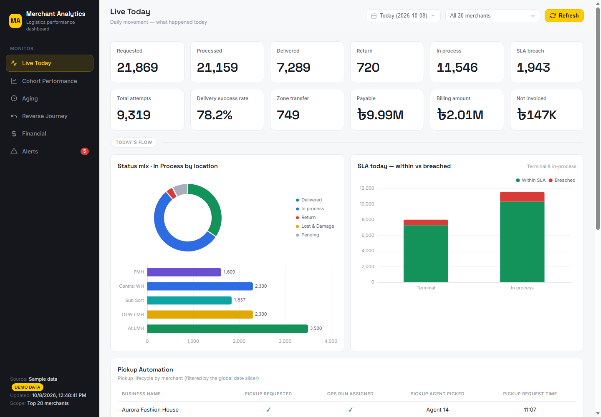
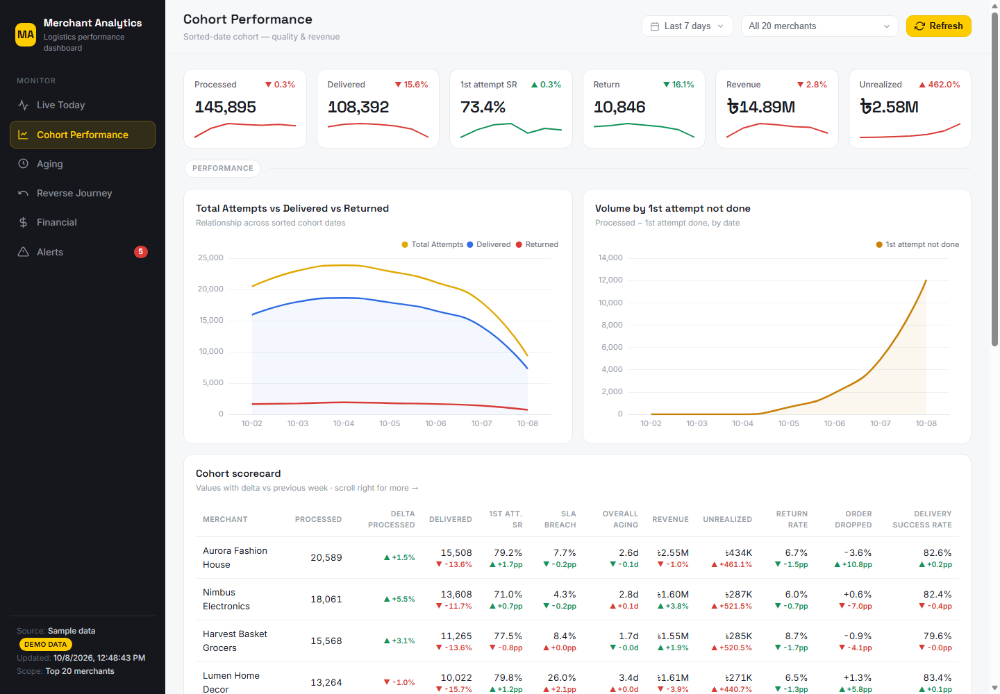
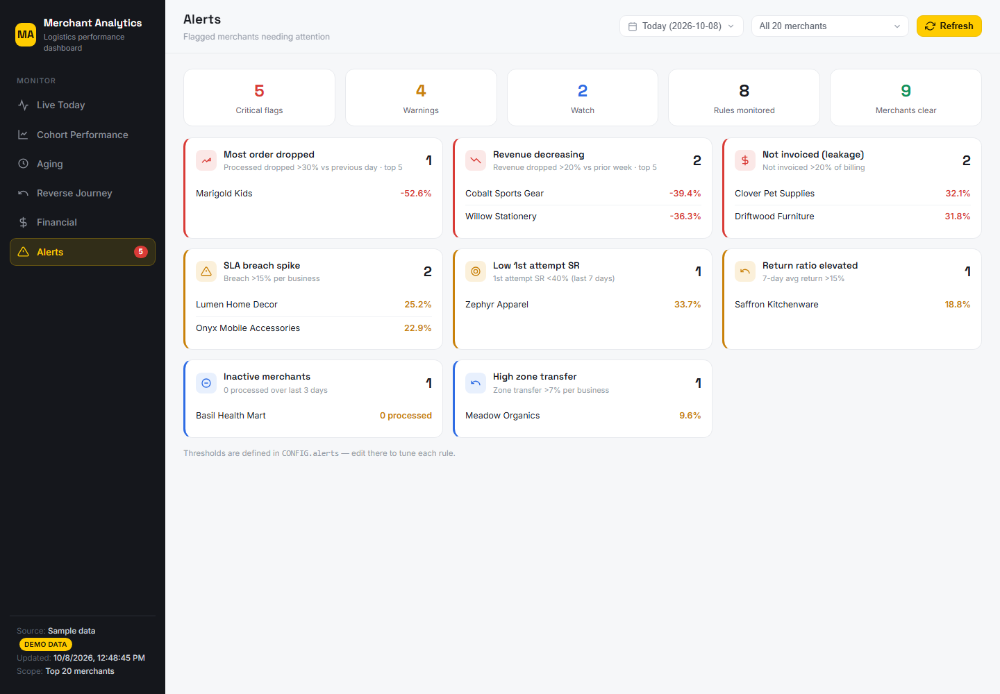

# Merchant Analytics Dashboard

An operations dashboard for a last-mile logistics business: daily parcel flow, cohort
quality, aging, reverse (returns) journey, revenue, and rule-based merchant alerts —
with team-based access control.

**[▶ Open the live dashboard](https://YOUR-USERNAME.github.io/merchant-analytics-dashboard/)** — runs in the browser, no install, no login.

> All merchants and figures in this repository are **generated sample data**.
> No real company, merchant, or customer data is included.



| Cohort performance | Alerts |
|---|---|
|  |  |

## What it does

| Page | Question it answers |
|---|---|
| **Live Today** | What moved today? Requested, processed, delivered, in-process by hub stage, SLA within vs breached, pickup automation status. |
| **Cohort Performance** | How good is the service per merchant? First-attempt success, SLA breach, aging, return rate — each with a delta against the previous day, week or month. |
| **Aging** | Where are parcels stuck? Day-bucket aging by delivery cluster, forward and reverse, with region-specific health thresholds. |
| **Reverse Journey** | How are returns flowing back to merchants, and which are critically old? |
| **Financial** | GMV, revenue, COD fees, discounts, realized vs unrealized revenue. |
| **Alerts** | Which merchants need attention right now? Eight rules: order drop, revenue decline, invoice leakage, SLA breach, low first-attempt success, high returns, inactivity, zone transfer. |

A global date slicer (day / week / month) and a merchant filter apply to every page.

## Background: from Apps Script to Next.js

The first version of this dashboard was a Google Apps Script web app reading a Google
Sheet that an ETL job refreshes four times a day.

This version keeps the same UI and metric logic and replaces everything around it:

- **Data layer** — one `batchGet` call to the Sheets API v4 with a read-only service
  account. Rows are keyed by header name, so reordering sheet columns cannot misalign data.
- **Caching** — results are cached for 6 hours and purged by a webhook the ETL calls
  after each run, so users see fresh data without hitting the Sheets API on every view.
- **Access control** — four teams sign in with a signed, HTTP-only JWT cookie. CSV export
  is restricted to one team and enforced on the server, not just hidden in the UI.
- **Deployment** — runs on Vercel, or on-prem as a standalone Node server under PM2
  with all assets served locally (no CDN dependency).

## Architecture

```
Google Sheet (ETL, 4x/day)          Demo mode
        │                               │
  lib/sheets.js  ◄── lib/config.js ──► lib/demoData.js
        │   (6h cache + webhook purge)  │   (generated in code)
        └───────────────┬───────────────┘
              /api/getDashboardData        middleware.js + lib/auth.js
                        │                  (JWT session, team roles)
              templates/dashboard.html
              (metrics + ECharts, client-side)
```

| Concern | File |
|---|---|
| Sheets engine, cache | `lib/sheets.js` |
| Sample-data generator | `lib/demoData.js` |
| Auth, roles | `lib/auth.js`, `middleware.js` |
| Dashboard UI and metric logic | `templates/dashboard.html`, served by `app/dashboard/route.js` |
| APIs (data, CSV, login, cache purge) | `app/api/**/route.js` |
| Static demo builder | `scripts/build-static.mjs` → `docs/index.html` |

**Stack:** Next.js 14 (App Router) · React 18 · ECharts 5 · Google Sheets API v4 · jose (JWT)

## Run it

```bash
npm install
npm run dev        # http://localhost:3000
```

With no configuration the app starts in **demo mode**: pick any of the four teams on
the login screen. Sign in as a team other than *Leads* and try **Export CSV** on the
Aging page to see the role gate.

### The sample data

`lib/demoData.js` generates 20 fictional merchants over a rolling 75-day window that
always ends today. Values are deterministic (a hash of merchant, date and field), so a
given day never changes between visits. A few merchants are given deliberate problems —
a sudden order drop, declining revenue, invoice leakage, SLA breaches — so every alert
rule has something to show.

### Static demo (GitHub Pages)

```bash
npm run build:static   # writes docs/index.html
```

This produces one self-contained HTML file with the generator inlined — no server and
no login. Publish it with **Settings → Pages → Deploy from a branch → `main` / `docs`**.

### Live mode (your own Google Sheet)

Copy `.env.example` to `.env` and fill it in:

1. Create a Google service account, enable the Sheets API, and share the sheet with
   the service account's email as **Viewer**.
2. Set `SHEET_ID`, the service account credentials, `AUTH_SECRET`, and a
   `TEAM_*_PASSWORD` for each team. There are no default passwords — a team without
   one cannot sign in.
3. Have your ETL purge the cache after each run:
   `curl -X POST -H "x-revalidate-secret: $REVALIDATE_SECRET" https://<host>/api/revalidate`

The sheet needs these tabs: *Daily Merchant Summary*, *Sorted Cohort Summary*,
*Financial Detail*, *Pickup Automation*, *CSV Export*, and the four
*Forward/Reverse Aging Analysis - Terminal/In Process* tabs (names are in `lib/sheets.js`).

**Vercel:** import the repo and add the environment variables.
**On-prem:** `npm run build`, copy `.next/static` and `public` into `.next/standalone`
(see `ecosystem.config.js`), then `pm2 start ecosystem.config.js` with `ASSET_MODE=local`.
